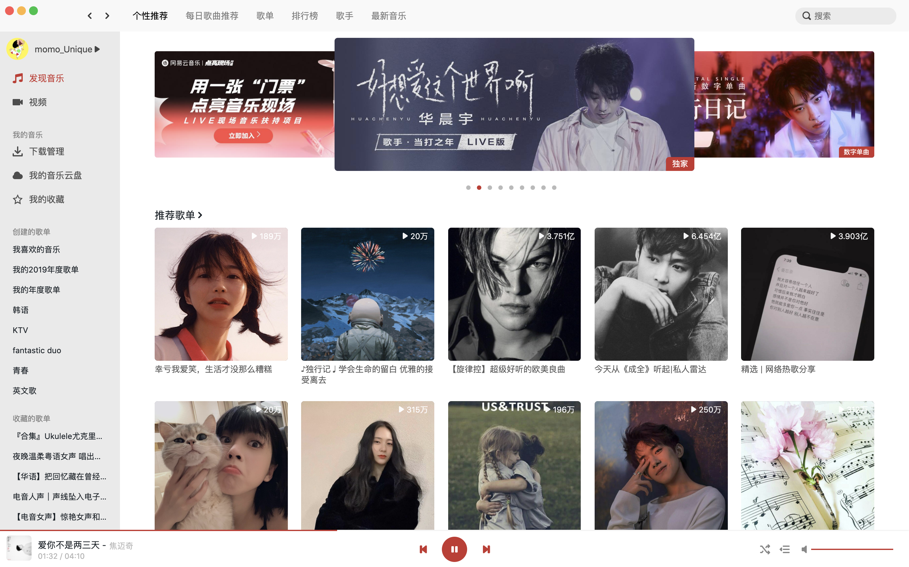
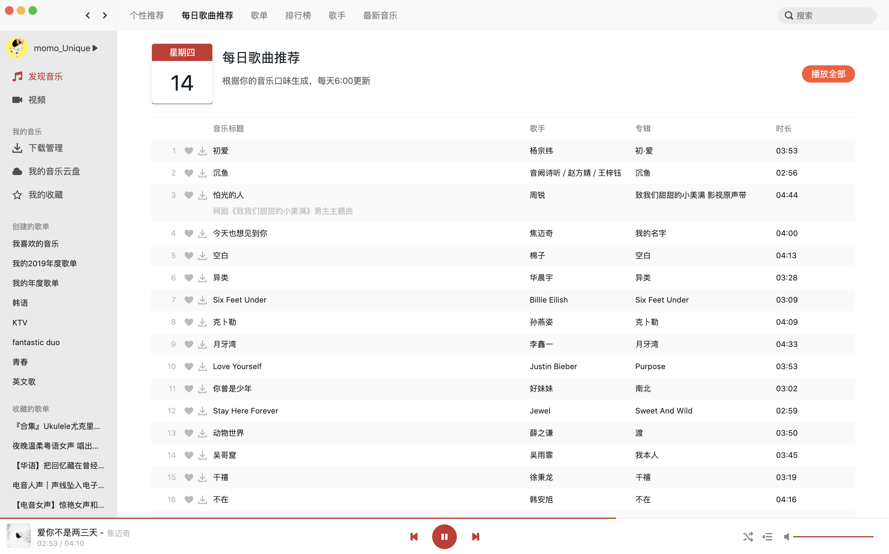
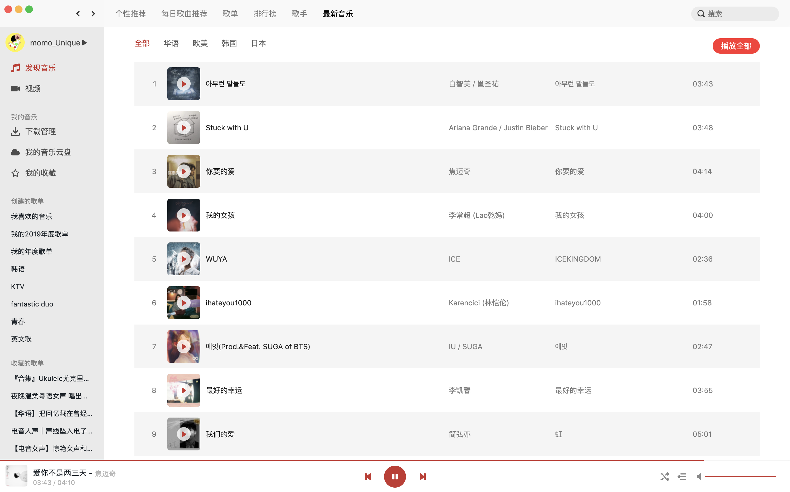
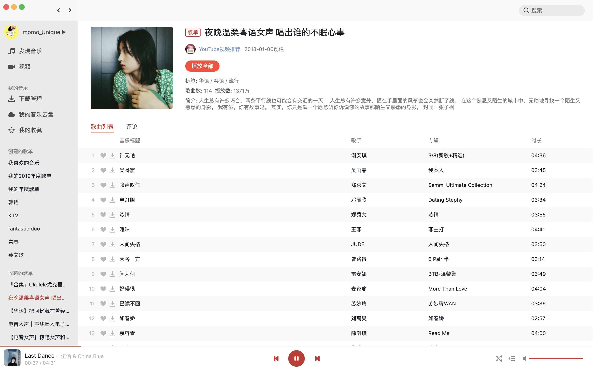
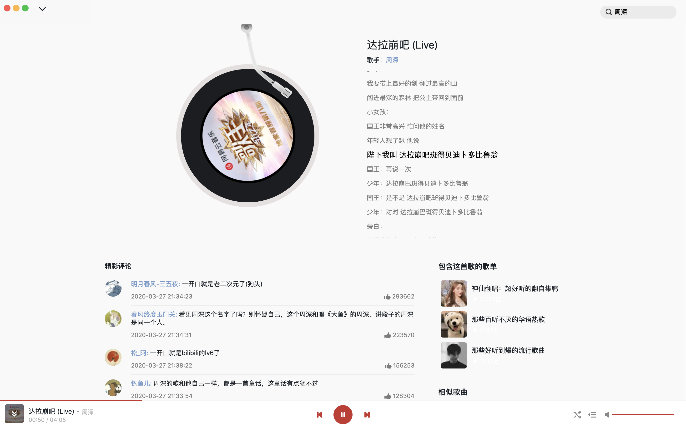
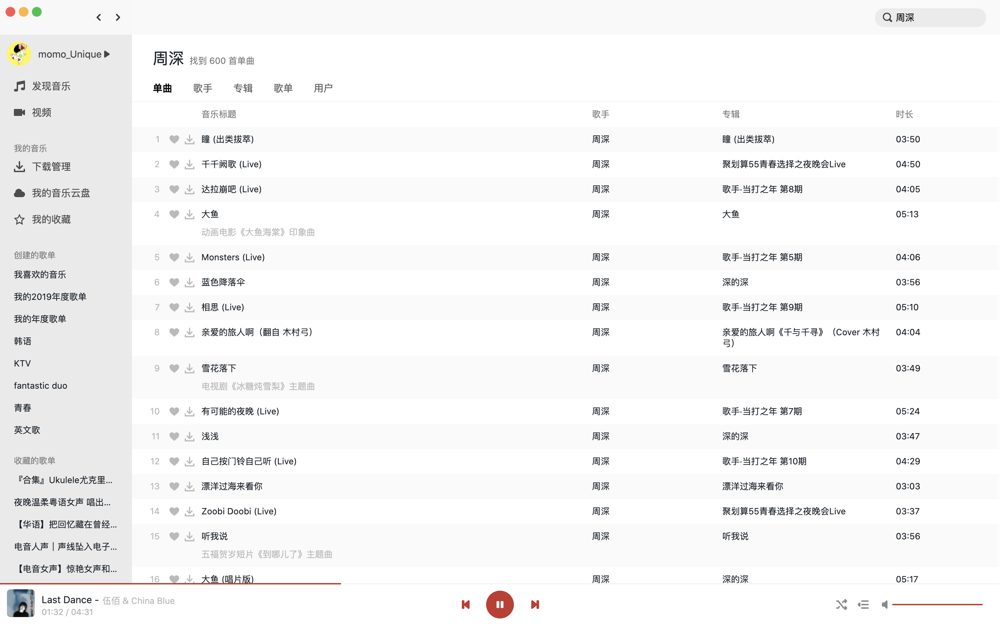

# React Netease Music
React Netease Music——一个基于React、TypeScript的高仿网易云mac客户端播放器。

一直想写一个音乐播放器把玩把玩，最近无意中发现很早就有人整理出了相关的API，话不多说，撸起来！代码使用React编写，没有使用额外的数据管理库（因为react hook真的挺方便的），欢迎提出你的意见，喜欢的话请给我一个star哈~

## 项目体验地址
[高仿网易云音乐播放器——音为爱呀😍](http://www.uniquemo.cn/discovery)

## 功能列表
- [x] 登录/登出（目前仅支持手机密码登录）
- [x] 发现页
  - [x] banner
  - [x] 推荐歌单
  - [x] 推荐最新音乐
  - [x] 推荐MV（仅是入口，详情待实现）
- [x] 每日歌曲推荐页
- [x] 全部歌单页
  - [x] 歌单分类查询
- [x] 最新音乐页
- [x] 歌单详情页
- [x] 音乐播放详情页
  - [x] 歌曲评论
  - [x] 点赞/取消点赞歌曲评论
  - [x] 歌词滚动
  - [x] 歌曲所在歌单
  - [x] 相似歌曲推荐
- [x] 播放记录功能
  - [x] 播放列表
  - [x] 历史记录
- [x] 搜索功能
  - [x] 热门搜索关键字
  - [x] 搜索建议
  - [x] 搜索结果页
- [x] 创建的歌单列表
- [x] 收藏的歌单列表
- [ ] 排行榜
- [ ] 所有歌手页
- [ ] 歌手详情页
- [ ] MV相关的页面与功能
- [ ] 创建/编辑/删除歌单
- [ ] 私信/@我/评论等通知功能
- [ ] 主题换肤
- [ ] ......看心情添加功能😂

注意：部分歌曲可能由于版权问题无法播放喔。

## 技术栈
- React，使用react hook做状态管理，没有使用额外的数据管理库。
- TypeScript，用TypeScript确实可以提高效率😃（容易发现错误）。
- Graphql，使用@apollo/client优化部分页面性能。
- @blueprintjs组件库，主要使用其中的Icon、Dialog、Toast、Spinner等。
- 逐渐使用[@uniquemo/mui](https://github.com/uniquemo/mui)替换@blueprinjs（Doing）。
- CSS Modules。
- Webpack。
- Eslint做代码检查。

## API接口
- [NeteaseCloudMusicApi](https://binaryify.github.io/NeteaseCloudMusicApi)
- [Express Graphql Server](https://github.com/uniquemo/express-graphql-server)

## 播放器的相关截图














## 项目启动
- 首先将上面👆提到的API接口部分，两个API服务代码拉到本地，并启动对应的服务；
- 然后拉取本仓库代码，并执行以下命令：
```
yarn
yarn dev:local
```
- 最后在浏览器中访问：`http://localhost:8080`
